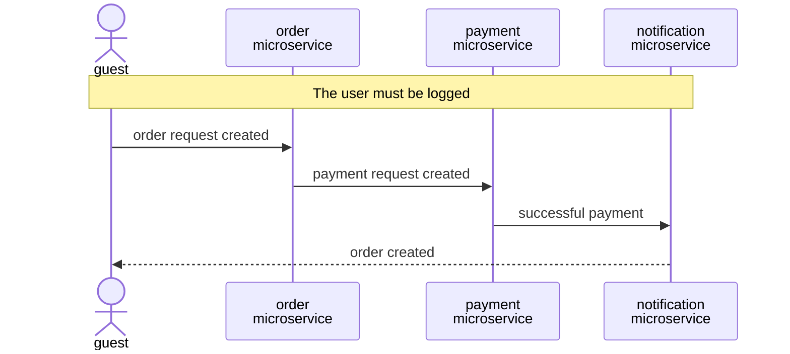

# eshop 

## Interaction of services 

```mermaid
sequenceDiagram
    actor guest
    participant os as order <br> microservice
    participant ps as payment <br> microservice
    participant ns as notification <br> microservice
    
    note over guest, ns: The user must be logged
    
    guest ->> os: order request created
    os ->> ps: payment request created
    ps ->> ns: successful payment
    ns -->> guest: order created
```
